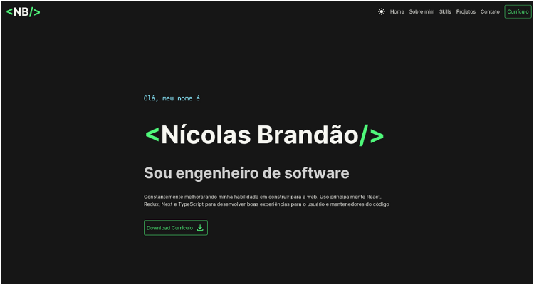

# 🚧 Personal Portfolio Page

<p align="center">
  <a href="#-description">Description</a>&nbsp;|&nbsp;
  <a href="#-deploy">Deploy</a>&nbsp;|&nbsp;
  <a href="#-tech-stack">Tech Stack</a>&nbsp;|&nbsp;
  <a href="#-install-and-scripts">Install & Scripts</a>&nbsp;|&nbsp;
  <a href="#-contribution">Contribution</a>&nbsp;|&nbsp;
  <a href="#-license">License</a>
</p>

<br>

<p align="center">
  
</p>


## 📙 Description

This is a personal portfolio web page to display professional projects, skills and experiences. This page was built primarily with Next and TypeScript


## 💻 Deploy

- [Click here](https://nicolasbrandao.vercel.app/) to go to a Vercel deploy of this app


## 🛠 Tech Stack

- Next
    - React
        - React Icons
    - TypeScript
- Tailwind
    - Classnames
- ESLint & Prettier
    - Airbnb JavaScript Style Guidelines


## 👨‍💻 Install and Scripts

Install dependecies:
```bash
  npm install
```

Run local server:
```bash
  npm run dev
```

Format files with Airbnb JavaScript Style Guidelines:
```bash
  npm run format
```

Create build for deploying:
```bash
  npm run build
```


## 👥 Contribution

If you'd like to contribute with to project, simply open up a Pull Request.


## 🔑 License

[MIT](https://choosealicense.com/licenses/mit/)

